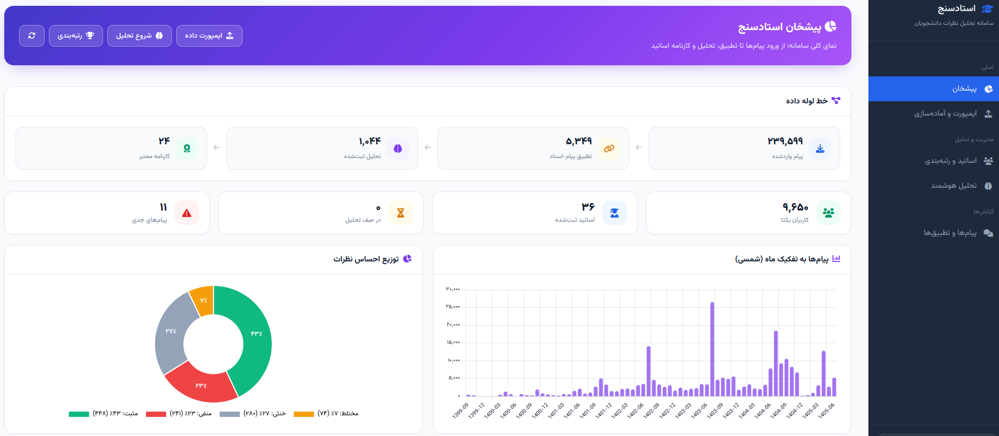
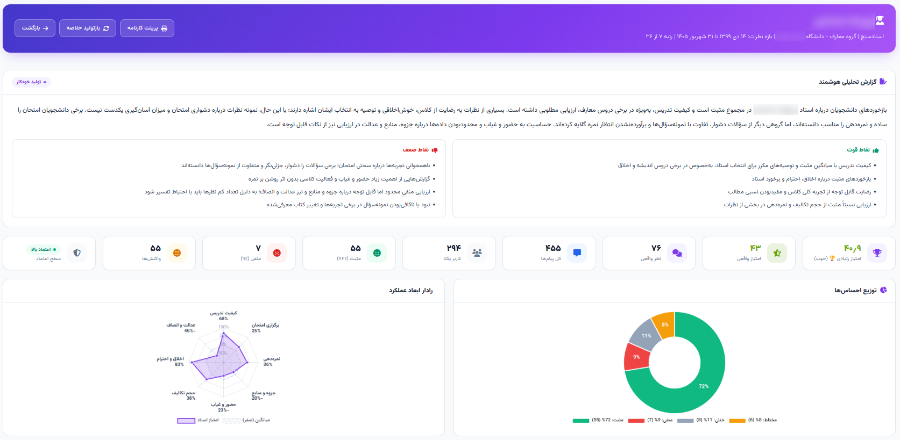
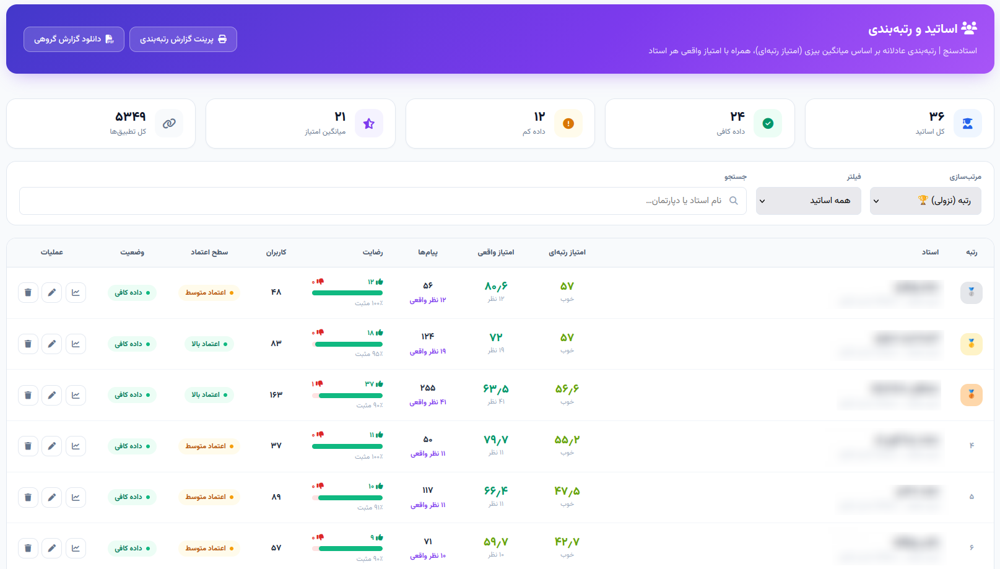
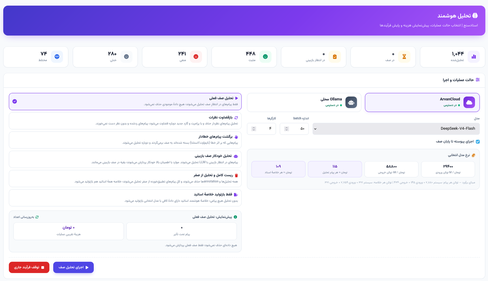

# استادسنج

سامانهٔ تحلیل هوشمند نظرات دانشجویان در گروه‌های تلگرامی دانشگاهی.

## ✨ ویژگی‌ها

- **تحلیل احساس خودکار** با LLM (ArvanCloud / Ollama)
- **رتبه‌بندی بیزی** اساتید بر اساس نظرات
- **همگام کردن هوشمند** پیام‌ها به اساتید (نام دقیق، هشتگ، زنجیرهٔ پاسخ)
- **صف بازبینی** برای موارد مبهم با قابلیت بازبینی خودکار
- **گزارش PDF** کامل

## 📷 گالری

  
  
  
  

## 🏗 معماری

- **Backend:** FastAPI + SQLAlchemy + SQLite
- **Frontend:** Vanilla JS + HTML + CSS
- **LLM Providers:** ArvanCloud API / Ollama

## 📃 بیشتر بخوانید
- #### [استادسنج؛ از بستر تا استاد برتر](https://www.rahro14.ir/?p=7157)

